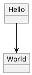

# gitbook-plugin-plantuml-svg

> Inject PlantUML into GitBook as an SVG element.

[![NPM][shield-npm]][npm]
[![Travis CI][shield-travis]][travis]
[![Coveralls][shield-coveralls]][coveralls]

This is forked from [wewei/gitbook-plugin-plantuml-svg][wewei/gitbook-plugin-plantuml-svg].

This plugin makes 1 additional improvement, you can do some configurations in `book.json`:

```json
{
  "pluginsConfig": {
    "plantuml-svg": {
      "serviceUrl": "http://plantuml-service-url/svg",
      "config": [
        "skinparam defaultFontName Microsoft YaHei",
        "skinparam defaultFontSize 14"
      ]
    }
  }
}
```

## Setup

```bash
# With NPM
$ npm install gitbook-plugin-plantuml-svg2

# With Yarn
$ yarn add gitbook-plugin-plantuml-svg2
```

In your `book.json`, add `plantuml-svg2` to the plugin list

```json
{
  "plugins": ["plantuml-svg2"]
}
```

## Usage

### Standalone PlantUML file

Say, you have `graph/my-chart.puml`.



In your Markdown document, put following lines.
```markdown


```

By default, the file path is relative to the project root. If you want the path
to be relative to current document, do

```markdown


```

### Inline PlantUML

The standalone PlantUML file is recommended for large graphs. However, for
simple graphs, you can also use inline plugin PlantUML.

```markdown

@startuml
object Hello
object World
Hello --> World
@enduml

```

[shield-npm]: https://img.shields.io/npm/v/gitbook-plugin-plantuml-svg2.svg
[npm]: https://www.npmjs.com/package/gitbook-plugin-plantuml-svg2
[shield-travis]: https://img.shields.io/travis/akuma/gitbook-plugin-plantuml-svg.svg
[travis]: https://travis-ci.org/akuma/gitbook-plugin-plantuml-svg
[shield-coveralls]: https://img.shields.io/coveralls/github/akuma/gitbook-plugin-plantuml-svg.svg
[coveralls]: https://coveralls.io/github/akuma/gitbook-plugin-plantuml-svg
[wewei/gitbook-plugin-plantuml-svg]: https://github.com/wewei/gitbook-plugin-plantuml-svg
